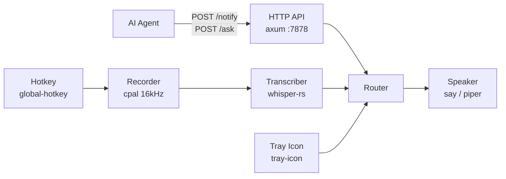

# CLAUDE.md

## What this is

Callout is a single-binary macOS background daemon that gives AI agents a voice interface. Agents call a local HTTP API (`localhost:7878`) to speak notifications and ask questions. The user replies via push-to-talk — no window switching, no terminal babysitting.

## Architecture



**Main thread constraint:** `global-hotkey` and `tray-icon` both require the AppKit event loop on the main thread. Tokio runs on a named background thread (`callout-tokio`). The main thread runs a tight `nextEventMatchingMask` loop — `NSApplication.run()` is never called because we need to poll `tray::poll()` each iteration for the quit signal.

## Build & test

```sh
make check               # cargo fmt --check + clippy -D warnings + tests
make run                 # cargo run
cargo test               # API integration tests (tests/api.rs)
callout ptt-test         # verify hotkey is registered
```

Requires a Whisper model at `~/.callout/models/ggml-base.bin` to run. Download with `callout model download`.

## Key files

| File | Role |
|------|------|
| `src/main.rs` | Entry point: spawns tokio thread, runs AppKit event loop on main thread |
| `src/api/` | axum handlers for `/notify`, `/ask`, `/agents`, `/status` |
| `src/router.rs` | oneshot channel map — registers pending `/ask` senders, resolves on voice input |
| `src/ptt.rs` | global-hotkey listener task |
| `src/recorder.rs` | cpal audio capture at 16kHz mono f32 |
| `src/transcriber.rs` | whisper-rs inference, applies glossary prompt |
| `src/speaker.rs` | TTS via macOS `say` or Linux `piper` |
| `src/tray.rs` | macOS status bar icon and dropdown menu |
| `src/agents.rs` | Agent registry with last-seen tracking and stale pruning |
| `src/glossary.rs` | `~/.callout/glossary.toml` — Whisper prompt biasing + post-transcription corrections |
| `src/config.rs` | `~/.callout/config.toml` deserialization with defaults |

## Conventions

- All cross-task communication uses tokio channels. Shared mutable state is `Arc<Mutex<_>>` only where channels aren't practical.
- The tray icon is built once at startup (`tray::build`) and updated via `tray::poll` in the AppKit loop — never from async code.
- `anyhow::Result` throughout internal code. API handlers return typed `axum::Json` responses with explicit status codes.
- Port default: `7878`. Model default: `base`. PTT key default: `Alt+K`.
