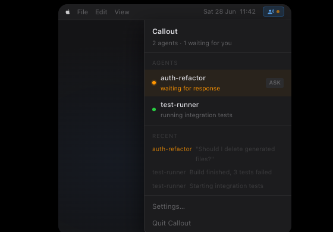
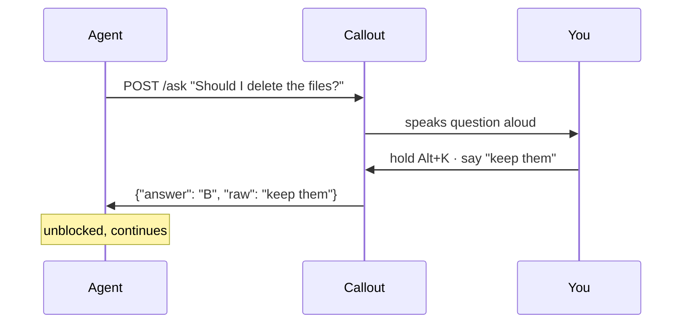

# callout

Ambient voice interface for AI agents on macOS. Runs silently in the background —
speaks up when an agent needs a decision, listens for your reply, routes the answer back.



## Quick start

**1. Install**

```sh
git clone https://github.com/TomasPhilippart/callout
cd callout
cargo install --path .
```

**2. Download a Whisper model**

```sh
callout model download    # ~148 MB, base model
```

**3. Run**

```sh
callout
```

Callout appears in your menu bar. Hold `Alt+K` to push to talk.

> **macOS permissions required:** System Settings → Privacy & Security →
> Microphone and Input Monitoring — enable Callout in both.

## How it works



## HTTP API

Callout listens on `localhost:7878`. All endpoints accept and return JSON.

### Register an agent

```sh
curl -s -X POST localhost:7878/agents/register \
  -H 'Content-Type: application/json' \
  -d '{"name": "my-agent", "context_terms": ["tokio", "axum"]}'
# → {"agent_id": "a1b2c3"}
```

Agents not seen for 5 minutes are pruned automatically. Deregister cleanly with `DELETE /agents/{agent_id}`.

Registration is optional — agents that skip it appear as `"unknown"` in the menu bar.

### Notify

Fire-and-forget. Callout speaks the message and returns `200` immediately.

```sh
curl -s -X POST localhost:7878/notify \
  -H 'Content-Type: application/json' \
  -d '{"agent_id": "a1b2c3", "message": "Build finished, 3 tests failed"}'
```

### Ask

Blocking. Callout speaks the question, listens for your voice response, and returns the transcript. Your agent just awaits the HTTP response.

```sh
curl -s -X POST localhost:7878/ask \
  -H 'Content-Type: application/json' \
  -d '{
    "agent_id": "a1b2c3",
    "question": "Should I delete the generated files?",
    "choices": [
      {"key": "A", "label": "Yes, delete them"},
      {"key": "B", "label": "No, keep them"}
    ],
    "timeout_seconds": 120,
    "default": "B"
  }'
# → {"answer": "B", "answers": ["B"], "raw": "no keep them", "timed_out": false}
```

`choices` is optional — omit it for a free-form voice answer. With `timeout_seconds` and `default` set, the agent continues automatically if you don't respond in time.

### Status

```sh
curl -s localhost:7878/status
# → {"agents": [{"id": "a1b2c3", "name": "my-agent", "state": "waiting", "last_seen": "5s ago"}]}
```

## Configuration

`~/.callout/config.toml` — all fields are optional, shown with their defaults:

```toml
port  = 7878
model = "base"     # tiny | base | small

[hotkey]
key = "Alt+K"

[tts]
voice = "Samantha"  # macOS: name as shown in `callout voices list`
```

Agent-specific vocabulary can be added to `~/.callout/glossary.toml` to improve transcription accuracy for technical terms:

```toml
terms = ["Claude", "tokio", "kubectl"]  # biases Whisper toward these spellings

[corrections]
"Cloud" = "Claude"  # hard find-and-replace after transcription
```

## CLI

```
callout                          start the daemon (default)
callout model download [size]    download a Whisper model  (tiny/base/small)
callout model list               list downloaded models
callout voices list              list available TTS voices
callout voices set <name>        set the active TTS voice
callout voices download          open System Settings to download more voices
callout ptt-test                 print the configured push-to-talk hotkey
```
